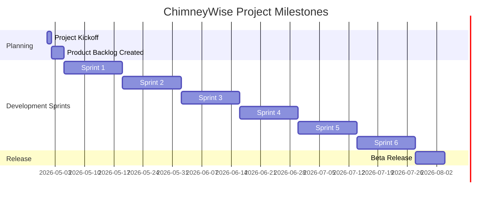

# Milestones & Gateways for ChimneyWise

## Metadata
| Key               | Value                             |
|-------------------|-----------------------------------|
| Id                | MILESTONES                        |
| crossReference    | BC, FURPS, KPI                    |

## Change log
| Version | Date       | Description              | Author           |
|---------|------------|--------------------------|------------------|
| 0003    | 2026-05-16 | Ensure all use cases have CrossReference | GitHub Copilot   |
| 0002    | 2026-05-16 | Refined milestones, tasks, and use cases | GitHub Copilot   |
| 0001    | 2026-04-27 | Initial                  | GitHub Copilot   |

---

## Gantt diagram

## Gateways & Milestones
| Milestone/Gateway      | Description                                         | Entry Criteria                        | Exit Criteria                         |
|-----------------------|-----------------------------------------------------|---------------------------------------|---------------------------------------|
| Project Kickoff       | Team alignment, project setup                       | Stakeholders available                | Project plan approved                  |
| Product Backlog       | Initial backlog, user stories                       | Project kickoff complete              | Backlog reviewed and prioritized       |
| Sprint 1              | Solution structure, identity & DB setup, initial API, Blazor setup | Backlog ready                         | Solution builds, identity and DB working, API/Blazor skeleton |
| Sprint 2              | Basic UI: core input for chimney data, output page for results | Sprint 1 review                       | Demo of chimney data input/output      |
| Sprint 3              | Implement authorization, navbar menu, error handling | Sprint 2 review                       | AuthZ to API/Blazor, working navbar, error handling demo |
| Sprint 4              | Multilanguage support, logging, performance metrics | Sprint 3 review                       | Demo of i18n, logging, perf metrics    |
| Sprint 5              | Advanced features: REST API, scalability, documentation | Sprint 4 review                       | Demo of REST API, scalability, docs    |
| Sprint 6              | Usability improvements, supportability, polish      | Sprint 5 review                       | Demo of usability/supportability features |
| Beta Release          | Testing, bug fixes, deployment, handover            | All sprints complete                  | Beta deployed, handover complete       |

## Use cases associated with each milestone/gateway
| Use Case ID | Description                                         | Milestone/Gateway | CrossReference |
|-------------|-----------------------------------------------------|-------------------|----------------|
| UC-001      | Initialize .NET solution structure (src/, tests/, Clean Architecture) | Sprint 1          | REQ-F-003      |
| UC-002      | Setup identity management and database              | Sprint 1          | REQ-F-001      |
| UC-003      | Implement authentication/authorization for API and Blazor | Sprint 3          | REQ-F-001      |
| UC-004      | Create basic UI for chimney data input and output   | Sprint 2          | REQ-F-002, REQ-U-001 |
| UC-005      | Add navigation bar (navbar) menu                    | Sprint 3          | REQ-U-001      |
| UC-006      | Add error handling and user feedback                | Sprint 3          | REQ-U-001      |
| UC-007      | Implement multi-language (Danish, English, German, French) | Sprint 4          | REQ-F-002      |
| UC-008      | Add logging and performance metrics                 | Sprint 4          | REQ-S-001, REQ-P-001 |
| UC-009      | Develop REST API for core features                  | Sprint 5          | REQ-INT-001    |
| UC-010      | Ensure scalability for 1000 concurrent users        | Sprint 5          | REQ-SCAL-001   |
| UC-011      | Write and update documentation                      | Sprint 5          | REQ-S-002      |
| UC-012      | Improve usability and supportability                | Sprint 6          | REQ-U-001, REQ-S-001 |
| UC-013      | Prepare deployment scripts and handover docs        | Beta Release      | REQ-S-003      |

## Notes
- Each sprint is 2 weeks (20 hours of dev time).
- Milestones and deliverables are reviewed at the end of each sprint.
- Use cases and quality attributes are referenced from BC, FURPS, and KPI artifacts.
